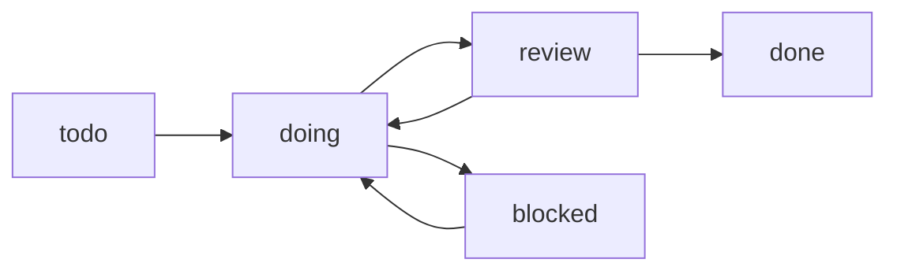
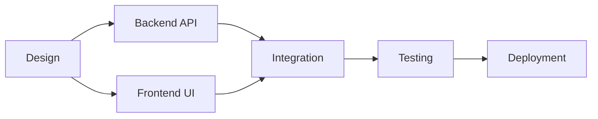

# Execution Model

Understand how TaskGuard manages task lifecycles and execution flow.

---

## Task Lifecycle

Tasks progress through defined states from creation to completion:



### Status Definitions

| Status | Meaning | When to Use |
|--------|---------|-------------|
| **todo** | Not started | Task created but work hasn't begun |
| **doing** | In progress | Actively working on task |
| **review** | Under review | Code/work ready for review |
| **done** | Completed | Task finished and verified |
| **blocked** | Blocked | Can't proceed due to dependencies or issues |

---

## Dependency-Driven Execution

TaskGuard uses **automatic dependency blocking** to ensure tasks are completed in the correct order.

### How It Works

1. **Task A** depends on **Task B**
2. Task A is **automatically blocked** until Task B is `done`
3. When Task B completes → Task A becomes **available**

### Example

```yaml
# setup-001.md (no dependencies)
dependencies: []
status: todo

# backend-001.md (depends on setup)
dependencies: [setup-001]
status: todo  # Blocked until setup-001 is done
```

**Validation:**
```bash
taskguard validate
```

**Output:**
```
🚦 TASK STATUS
   ✅ Available tasks (dependencies satisfied):
      ⭕ setup-001 - Project Setup

   🚫 Blocked tasks:
      ❌ backend-001 - Backend API (waiting for: setup-001)
```

---

## Execution Workflows

### Sequential Workflow

Tasks completed one after another:

```
setup-001 → backend-001 → api-001 → testing-001
```

**Setup:**
```yaml
# setup-001.md
dependencies: []

# backend-001.md
dependencies: [setup-001]

# api-001.md
dependencies: [backend-001]

# testing-001.md
dependencies: [api-001]
```

**Execution:**
1. Start with `setup-001` (no dependencies)
2. Complete `setup-001` → `backend-001` becomes available
3. Complete `backend-001` → `api-001` becomes available
4. Complete `api-001` → `testing-001` becomes available

### Parallel Workflow

Multiple tasks can run simultaneously:

```
        ┌─→ frontend-001 ─┐
setup-001                 → integration-001
        └─→ backend-001 ──┘
```

**Setup:**
```yaml
# frontend-001.md
dependencies: [setup-001]

# backend-001.md
dependencies: [setup-001]

# integration-001.md
dependencies: [frontend-001, backend-001]
```

**Execution:**
1. Complete `setup-001`
2. **Both** `frontend-001` and `backend-001` become available
3. Work on them in parallel
4. When **both** complete → `integration-001` becomes available

### Diamond Workflow

Complex dependency patterns:

```
           ┌─→ task-B ─┐
task-A ──→             ├─→ task-E
           └─→ task-C ─┘
                 │
                 ↓
              task-D ──┘
```

**Setup:**
```yaml
# task-B.md
dependencies: [task-A]

# task-C.md
dependencies: [task-A]

# task-D.md
dependencies: [task-C]

# task-E.md
dependencies: [task-B, task-D]
```

---

## Status Transitions

### Manual Transitions

Update status via CLI:

```bash
# Start work
taskguard update status backend-001 doing

# Send for review
taskguard update status backend-001 review

# Mark complete
taskguard update status backend-001 done

# Block on issue
taskguard update status backend-001 blocked
```

### Git-Based Suggestions

TaskGuard analyzes Git commits and suggests status updates:

```bash
# Make commits with task IDs
git commit -m "backend-001: Implement authentication logic"
git commit -m "backend-001: Add tests and documentation"

# Sync from Git
taskguard sync

# TaskGuard suggests: backend-001 → done (confidence: 0.8)
```

**Commit patterns analyzed:**
- `"fix backend-001"` → suggests `done`
- `"start backend-001"` → suggests `doing`
- `"WIP backend-001"` → suggests `doing`
- Multiple commits → suggests `review`

---

## Blocking Behavior

### Automatic Blocking

Tasks are **automatically unavailable** when dependencies aren't met:

```yaml
# api-001.md
dependencies: [backend-001, auth-001]
```

**Blocked if:**
- `backend-001` is NOT `done` **OR**
- `auth-001` is NOT `done`

**Available when:**
- `backend-001` is `done` **AND**
- `auth-001` is `done`

### Manual Blocking

Mark task as `blocked` for non-dependency reasons:

```bash
taskguard update status backend-001 blocked
```

**Use cases:**
- Waiting for external input
- Technical blocker discovered
- Resource unavailable

**Add note in task file:**
```markdown
## Updates
- 2025-10-05: Blocked - Waiting for API key from vendor
```

---

## Validation Rules

### Dependency Validation

`taskguard validate` checks:

1. **Missing Dependencies**
   ```yaml
   dependencies: [nonexistent-001]
   ```
   ❌ Error: `Depends on non-existent task`

2. **Circular Dependencies**
   ```yaml
   # A depends on B
   # B depends on A
   ```
   ❌ Error: `Circular dependency detected`

3. **Status Consistency**
   - Task marked `done` but dependents still `todo` → Warning

### Example Validation Output

```bash
taskguard validate
```

**Success:**
```
✅ VALIDATION PASSED
   No issues found in 15 tasks
```

**Errors:**
```
❌ VALIDATION FAILED

Dependency Issues:
   ❌ api-001: Depends on missing task 'backend-099'
   ❌ setup-002: Circular dependency (setup-002 → backend-001 → setup-002)

Parse Errors:
   ⚠️  frontend-005.md: Invalid YAML front-matter

📊 SUMMARY
   Total tasks: 15
   Available: 3
   Blocked: 10
   Parse errors: 1
   Dependency issues: 2
```

---

## Concurrency & Parallelism

### What Can Run in Parallel

Tasks with **no shared dependencies** can run simultaneously:

```yaml
# These CAN run in parallel:
backend-001: dependencies: [setup-001]
frontend-001: dependencies: [setup-001]

# They share setup-001 but don't depend on each other
```

### What Cannot Run in Parallel

Tasks with **sequential dependencies** must run in order:

```yaml
# These MUST run sequentially:
setup-001: dependencies: []
backend-001: dependencies: [setup-001]
api-001: dependencies: [backend-001]

# setup-001 → backend-001 → api-001 (sequential chain)
```

---

## Task Completion Criteria

### When to Mark a Task `done`

✅ **All checklist items completed**
```markdown
## Tasks
- [x] Install dependencies
- [x] Implement feature
- [x] Write tests
- [x] Update documentation
```

✅ **Acceptance criteria met**
```markdown
## Acceptance Criteria
✅ All tests passing
✅ Code reviewed and approved
✅ Documentation updated
```

✅ **Changes committed to Git**
```bash
git commit -m "backend-001: Complete authentication implementation"
```

### When NOT to Mark `done`

❌ Work incomplete
❌ Tests failing
❌ Review not completed
❌ Acceptance criteria not met

**Use `review` status** if implementation is done but needs approval.

---

## Best Practices

### 1. Small, Focused Tasks
✅ "Implement JWT authentication"
❌ "Build entire backend"

**Why:** Easier to track, test, and complete

### 2. Clear Dependencies
✅ Explicit: `dependencies: [setup-001, config-001]`
❌ Implicit: Assumed but not declared

**Why:** Prevents parallel work on dependent tasks

### 3. Granular Status Updates
✅ Update status as work progresses
❌ Leave as `todo` until 100% done

**Why:** Better visibility into progress

### 4. Use Checklist Items
```markdown
## Tasks
- [x] Phase 1: Setup
- [ ] Phase 2: Implementation
- [ ] Phase 3: Testing
```

**Update via CLI:**
```bash
taskguard task update backend-001 1 done
```

---

## Execution Examples

### Example 1: Feature Development



**Workflow:**
1. Complete design spec (`design-001`)
2. **Parallel:** Backend (`backend-001`) + Frontend (`frontend-001`)
3. Integration tests (`testing-001`) after both complete
4. Deploy (`deployment-001`) after tests pass

### Example 2: Bug Fix

```yaml
# bug-001.md
status: todo → doing → done

# No dependencies
# Direct: todo → doing → done
```

**Workflow:**
1. Create bug task
2. Update to `doing` while investigating
3. Fix and test
4. Mark `done`

---

## Next Steps

- [State Management](state-management.md) - How TaskGuard persists state
- [Dependencies Guide](../features/dependencies.md) - Advanced dependency patterns
- [Git Sync](../features/git-sync.md) - Automate status updates
